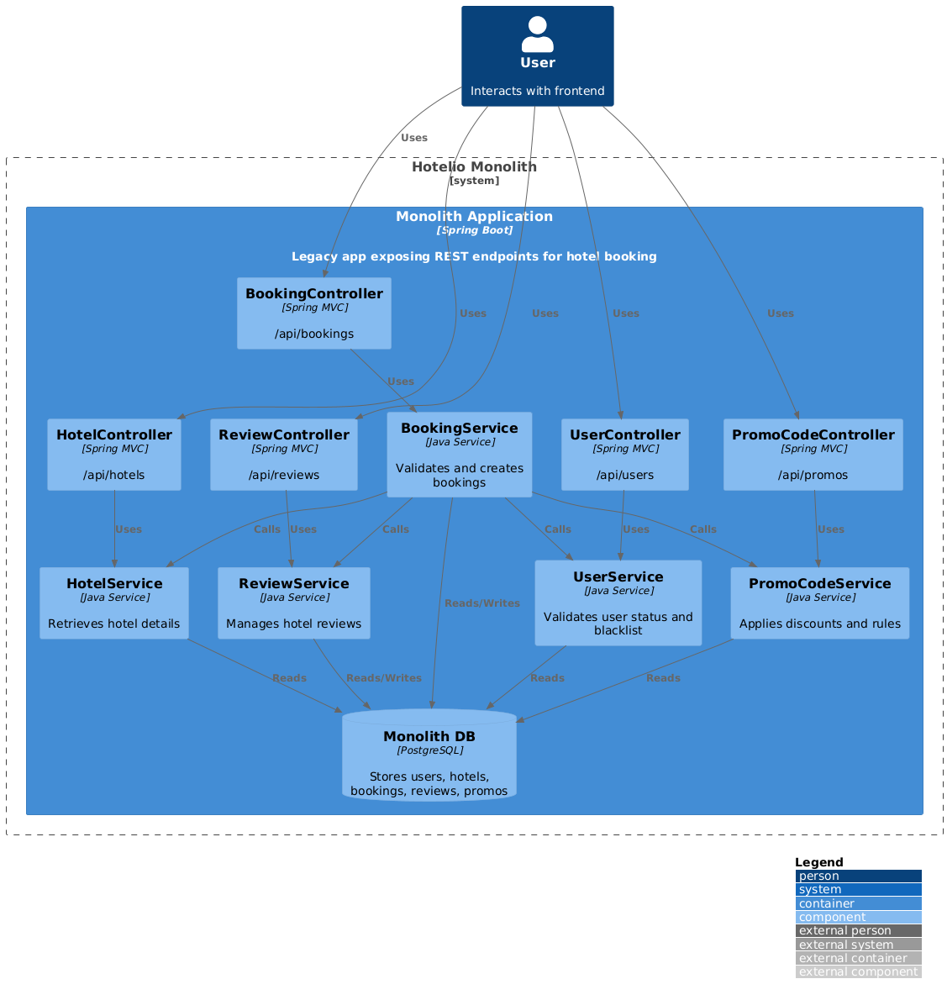

# Сдача проектной работы 2

В этом уроке вам предстоит сдать проектную работу второго спринта.  
Здесь вы найдёте описание заданий и форму, в которую нужно отправить ответ.  
Она появится после нажатия на кнопку **«Сдать работу»** в конце страницы.

**Желаем приятной работы!**

---

## Кейс компании Hotelio

Вы поработаете с кейсом компании **Hotelio**.

**Hotelio** — онлайн-платформа для бронирования отелей и апартаментов.  
У неё около **1 млн зарегистрированных пользователей**, и основной трафик приходится на поиск и бронирование жилья.

Система построена на **Java-монолите**, который обеспечивает API для клиентов и партнёрских каналов.

---

## Проблематика

Сервис **Hotelio** реализован как единое приложение, в котором:

- все бизнес-функции собраны в одном коде;
- разворачиваются как единый сервис;
- используют одну базу данных.

С ростом бизнеса возникли серьёзные архитектурные и операционные проблемы.  
Команда приняла решение о переходе на **микросервисную архитектуру** с постепенным выносом сервисов.

---

## Текущие проблемы

### 1. Сложность сопровождения

- Любое изменение требует понимания всей кодовой базы.
- Невозможно менять один модуль, не затрагивая другие.

### 2. Низкая масштабируемость

- При пиковых нагрузках (например, на бронирование) нельзя масштабировать только нужный компонент.
- Производительность неравномерна.

### 3. Невозможность гибкой разработки

- Разные команды не могут работать независимо.
- Трудно внедрить быстрый CI/CD.

### 4. Ограничения на фронтенде

- REST API монолита слишком универсален и плохо адаптируется под разные платформы.
- Нет поддержки BFF.

### 5. Сложности с запуском новых фич

- Большой риск ошибок из-за плотной связанности.
- Тестирование требует понимания всех зависимостей.

---

Вам как раз предстоит более детально проанализировать архитектуру системы и выделить наиболее критичные проблемы.

---

## Лендскейп компании

### Структура IT-отдела:

- два разработчика на Java;
- архитектор, который в том числе пишет код;
- фронтенд-разработчик;
- DevOps-инженер;
- тестировщик;
- продукт-менеджер.

### Текущая инфраструктура

- Java Spring Boot (монолит и сервисы);
- PostgreSQL;
- Kafka;
- Docker.

---

## Архитектура системы



**Код диаграммы в PlantUML:** [current_architecture.puml](sprint_stuff/current_architecture.puml)

### Назначение модулей

#### BookingService

Обрабатывает создание бронирований.  
Выполняет все проверки: пользователя, отеля, промокода, отзывов.  
Вычисляет финальную цену, скидку и сохраняет результат.

#### UserService

Проверяет статус пользователя: активен ли он, не находится ли в чёрном списке.  
И возвращает его статус.

#### HotelService

Предоставляет информацию об отелях.  
Используется для валидации бронирования и отображения информации в интерфейсе.

#### PromoCodeService

Проверяет промокоды: действительность, применимость к конкретному пользователю.

#### ReviewService

Отвечает за отзывы и рейтинг отеля.  
Влияет на возможность бронирования, если у отеля плохая репутация.

---

## Цели бизнеса

Начать поэтапный переход к микросервисной архитектуре, применяя паттерн **Strangler Fig**, — выносить по одному
компоненту, оставляя остальной функционал в монолите.

Это позволит:

- упростить масштабирование;
- снизить время выхода фич;
- повысить отказоустойчивость;
- упростить независимую разработку разных команд.

## Финальное целевое состояние через год

- Полный переход на микросервисную архитектуру.
- Service mesh с автоматизированными rollouts.
- Масштабируемая Kafka-инфраструктура.
- Метрики и трассировка на каждый сервис.
- GraphQL для фронтенда.

---

> ## В рамках проектной работы
>
> Нужно спроектировать изменения в ближайшей перспективе.  
> А именно промежуточное состояние через пару месяцев:
>
> - Мигрировано несколько сервисов.
> - Старые сервисы не дорабатываются.
> - Новая функциональность пишется только уже в мигрированных сервисах.
> - Начато разделение баз для балансировки нагрузки и переезда в облако.

### Что нужно сделать

Сделайте форк репозитория с исходными файлами для выполнения проектной работы:  
https://github.com/Yandex-Practicum/msa-sprint2

Проект состоит из четырёх заданий.  
Для них в репозитории создана папка `tasks`.

Работать над заданиями вы можете в удобном месте.  
Результаты же сложите в подпапку `results` для каждого из четырёх заданий.

Когда вы выполните все задания проекта, создайте **пул-реквест** из веток с результатами заданий в основную ветку вашего
репозитория.  
Убедитесь, что пул-реквест содержит все изменения, которые вы вносили.

---

## Какие инструменты нужны для работы

Для работы над заданиями вам понадобятся:

- Docker Compose
- IDE
- PlantUML

> Приложение написано на Java. Мы понимаем, что не все имеют опыт работы с Java,
> и поэтому сделали приложение простым и интуитивно понятным. В целом важно понимать,
> что специалисты, занимающиеся проработкой архитектуры системы, часто осваивают новые для себя технологии.
> Работа над этим проектом поможет вам легче адаптироваться к будущим задачам
> с неизвестным стеком.

# Задание 1. Проработка миграции от монолита к микросервисам

**Цель задания:** подготовить архитектурный анализ и план начала миграции на микросервисы.

Впереди масштабная трансформация — разделение монолитного Java-приложения на независимые сервисы.

---

## Что нужно сделать

1. Изучите текущий код монолита.  
   В директории `architecture` в `readme.md` вы найдёте описание модулей системы, структуру проекта и список
   API-эндпоинтов и их поведение.

2. Составьте **ADR**.  
   Оно будет описывать целевое состояние системы. Выберите уровень детализации и количество диаграмм и ADR.

    - Подсветите ключевые проблемы — существующие и найденные вами.
    - Предложите опции решений и их дизайн — как решить текущие проблемы.
    - Прописать план миграции — как перейти к целевому состоянию.

3. Поскольку ресурсы ограничены, начать миграцию нужно с одного модуля.  
   Определите, какой модуль это будет, и обоснуйте, почему именно он.  
   Сформулируйте план на основе **Strangler Fig**.

4. Перед переходом к заданию запустите приложение и базу данных, выполните тесты (см. `tests/readme`).  
   Это поможет лучше понять архитектуру системы.

5. Чтобы сдать решение в формате ADR, используйте шаблон [adr_template.md](sprint_stuff/adr_template.md).

В `README.md` лежит дополнительная информация о работе системы и советы по работе над заданиями. Обратите на них
внимание.

## Подсказки по подготовке окружения, сборке и запуску приложения

### Подготовка окружения

Установите **Docker** и **Docker Compose**.

Создайте **Docker-сеть** (если ещё не создана):

`docker network create hotelio-net`

Для удобства просмотра кода может понадобиться:

- Установите **JDK 17**
- Установите **Gradle** (или используйте встроенную в Idea)
- Установить **Idea** или **Visual Studio Code**

---

### Сборка приложения

`./gradlew build`

---

### Запуск приложения

`docker-compose up -d --build`

---

### Получаемые компоненты

- **PostgreSQL** (порт 5432) (5432 host машина)
- **hotelio-monolith** (порт 8080) (8084 host машина)

---

### Проверка работоспособности

`curl http://localhost:8084/bookings`

--- 

## Образ результата

Структура и содержание репозитория, в котором нужно сдать решение:

```text
├── ADR/diagram  
└── test-log.txt — выгрузка логов или скриншот проверки API и кодовой базы
```

Загрузите результат в директорию `task1/results/` вашего репозитория.

# Задание 2. Реализация новых сервисов

**Цель задания:** начать миграцию сервисов — реализовать сервис бронирования с использованием Kafka.

В этом задании вы будете реализовывать один из сервисов системы.  
Предлагаем сделать это на примере сервиса бронирований **BookingService**.

Вы можете сделать это на любом языке, который вам ближе.  
Общение между сервисом и остальной системой было решено реализовать через **gRPC**.

---

## Настройка прокси в монолите

Для включения прокси в монолите нужно передать в environment контейнера следующие значения:

BOOKING_SERVICE_EXTERNAL_HOST: booking-service  
BOOKING_SERVICE_EXTERNAL_PORT: 9090

---

## Реализация сервиса статистики

Вам предстоит реализовать сервис **booking-statistics** с помощью Kafka.

Отдел аналитики передал, что ему нужны данные по бронированиям — по пользователям, по отелям, по дням и так далее.  
DevOps-инженер не даёт доступ к боевой базе. Статистику нужно посчитать в новом сервисе.

Решение — не добавлять дополнительную логику в только что выделенный сервис.  
Вместо этого — создать отдельный микросервис **booking-history-service**.

Для реализации этого нужно пока добавить Kafka в контейнер монолита: общая сеть ещё не готова.

Пример готовой конфигурации есть в workspace для `task2`.

---

## Конфигурация Kafka

```
kafka:  
  image: confluentinc/cp-kafka:7.2.1  
  ports:  
    - "9092:9092"  
  environment:  
    KAFKA_BROKER_ID: 1  
    KAFKA_ZOOKEEPER_CONNECT: zookeeper:2181  
    KAFKA_ADVERTISED_LISTENERS: PLAINTEXT://kafka:9092  
    KAFKA_OFFSETS_TOPIC_REPLICATION_FACTOR: 1  
  networks:  
    - hotelio-net  

zookeeper:  
  image: confluentinc/cp-zookeeper:7.2.1  
  ports:  
    - "2181:2181"  
  environment:  
    ZOOKEEPER_CLIENT_PORT: 2181  
    ZOOKEEPER_TICK_TIME: 2000  
  networks:  
    - hotelio-net  
```

---

## Что нужно сделать

### 1. Создать сервис booking-service

Сервис должен:

- Использовать `booking.proto` контракт — расположен в рабочей директории `task2`.
- Подниматься в Docker.
- Использовать отдельную базу в Docker (можно выполнить аналогично monolith).
- Быть в той же сети.

networks:  
hotelio-net:  
external: true

В `docker-compose` файле измените host/port на host/port вашего сервиса (дефолт `localhost:9090`).

Измените тесты для booking сервиса так, чтобы они соответствовали вашей текущей реализации.  
Тесты расположены в папке `test` в корне проекта.

---

### 2. Создать сервис booking-history-service

- Сервис должен читать события из Kafka.
- Kafka уже создаётся в рамках `docker-compose`.
- Доработайте booking-service, чтобы он писал события в Kafka.
- Визуально проверьте появление исторической записи после запуска тестов.
- Возможно, нужно будет добавить тесты.

---

## Подсказки по подготовке окружения

Выполните в папке первого задания:

`docker compose down`

Это связано с тем, что необходима пересборка контейнера для задания 2.

И затем поднимите приложение в папке второго задания:

`docker compose up -d --build`

---

## Проверка корректности

В логах приложения должно быть:

```
➡️  BookingService beans:  
    - bookingService: class com.hotelio.monolith.service.BookingService  
    - grpcBookingService: class com.hotelio.GrpcBookingService  
```

При запуске тестов, тесты на booking должны упасть.

---

## Образ результата

- При создании бронирования монолит перенаправляет запрос на `create booking` на указанный gRPC Server.
- Запрос списка бронирований в монолите работает так же, как раньше — будет убран другой командой позже.
- В сервисе booking-service реализована вся необходимая логика.
- Входной точкой для booking-логики становится новый микросервис.
- Все остальные вызовы остаются в монолите.
- Логику для остальных сервисов переносить не нужно: данные в микросервисе должны получаться через REST.
- Сервис booking-service отправляет событие в Kafka (BookingCreated).
- Сервис booking-history-service слушает события и формирует статистику асинхронно, без нагрузки на боевую БД.

---

## Структура и содержание репозитория, в котором нужно сдать решение

task2/results/

```
├── Лог/скриншот `docker ps`  
├── Доработанный regress.sh (мб. init-fixtures)  
├── test-log.txt (проведение тестовых запросов)  
├── select * from bookings из новой системы и старой в текстовом виде после выполнения тестов  
├── README.md с объяснением стратегии миграции данных при запуске нового сервиса и стратегии To Be  
├── листинг бронирований, вызванный через REST из монолита и GRPC из микросервиса  
└── select * из таблицы с историческими данными о бронированиях
```

Загрузите результат в директорию `task2/results/` вашего репозитория.

# Задание 3. Личный кабинет

## Цель задания

**GraphQL Federation:**

- реализовывать federated-сервисы на Node.js,
- интегрировать внешние сервисы,
- добавить ACL на уровне GraphQL-поля или запроса.

---

После первых шагов по выделению модуля бронирования в отдельный gRPC-сервис, команда Hotelio столкнулась с новой
задачей: реализовать личный кабинет, обеспечив удобный и быстрый доступ к информации из нескольких доменов сразу —
бронирования и отели.

Этот модуль важен для расширения бизнеса.

Текущие REST-интерфейсы монолита и один gRPC не позволяют гибко агрегировать данные между сервисами без множества
последовательных вызовов. Особенно это ощущается при разработке фронтенда.

После некоторых решений вы понимаете, что **BFF в данном случае просто необходим**.  
Решить такую задачу удобно и гибко лишь на API Gateway тяжело.

Hotelio решила перейти к **GraphQL-шлюзу**, используя **Apollo Federation**, где каждый домен будет представлен в виде
субграфа, объединённый в общий суперграф.

Предполагается, что в дальнейшем появится полноценный API Gateway, поэтому можно сразу продумать, как разграничить
доступ к информации. Например, чтобы пользователь не мог видеть чужие бронирования.

## Что нужно сделать

Ваша задача — завершить реализацию федеративного **GraphQL API** с тремя модулями.

### 1. Сервис booking-subgraph

- Бронирования возвращаются по `userId`.
- Есть поля:
    - `id`
    - `userId`
    - `hotelId`
    - `promoCode`
    - `discountPercent`

Необходимо:

- заменить заглушки на реальные вызовы (например, к базе, REST, gRPC),
- реализовать **ACL**, чтобы пользователь мог видеть только свои бронирования.

### 2. Сервис hotel-subgraph

- Возвращает описание отелей.
- Используется для `hotel { ... }` внутри бронирования.
- Должен уметь обращаться к внешнему API или сервису.
- Должно быть разрешено `__resolveReference` через ID.

### 3. Сервис apollo-gateway

- Агрегирует схемы booking и hotel.
- Проксирует запросы к нужным подграфам.
- Если сервисы работают, менять это не надо.

## Подсказки по подготовке окружения

Ознакомьтесь с предложенной структурой.

Поднять сервис можно с помощью:

`docker compose up -d --build`

## Проверка корректности

Выполните следующий GraphQL-запрос через GraphQL Playground на:

`http://localhost:4000/`

```graphql
    query {
    bookingsByUser(userId: "user1") {
        id
        hotel {
            name
            city
        }
        discountPercent
    }
}
```

Можно запрашивать больше данных.

Перед этим добавьте заголовок:

`userid: user1`

Иначе данные не вернутся из-за ACL.

## Образ результата

### Структура проекта

```text
task3/
├── booking-subgraph/
│   ├── index.js               // TODO: заменить заглушки на вызовы
│   └── ...
├── hotel-subgraph/
│   ├── index.js               // TODO: заменить заглушки на вызовы
│   └── ...
├── apollo-gateway/
│   ├── index.js               // Gateway-конфигурация
│   └── ...
├── docker-compose.yml         // Запускает все 3 модуля
└── README.md                  
```

---

## Что можно использовать вместо внешнего вызова

Если у вас нет готового API — вставьте заглушку вида:

```javascript
return [
    {
        id: 'b1',
        userId,
        hotelId: 'h1',
        discountPercent: 20,
        promoCode: 'SUMMER',
    },
];
```

Но лучше попробовать подставить REST/gRPC-вызов из прошлого задания.

## Подсказки

- Все заголовки передаются из API Gateway в подграфы автоматически.
- Для реализации ACL проверяйте `req.headers['userid']` в резолверах.
- Если пользователь не авторизован, не возвращайте бронирование.
- При использовании реальных модулей не забудьте использовать одну и ту же сеть в Docker.

## Структура и содержание репозитория, в котором нужно сдать решение

```text
task3/results/
├── Report с описанием внесённых изменений
├── Результат docker ps
├── Скриншот успешного вызова 
├── Скриншот Deny по ACL 
└── Логи booking-subgraph после двух запросов (или всех контейнеров через docker-compose up --build)
```

Загрузите результат в директорию `task3/results/` вашего репозитория.