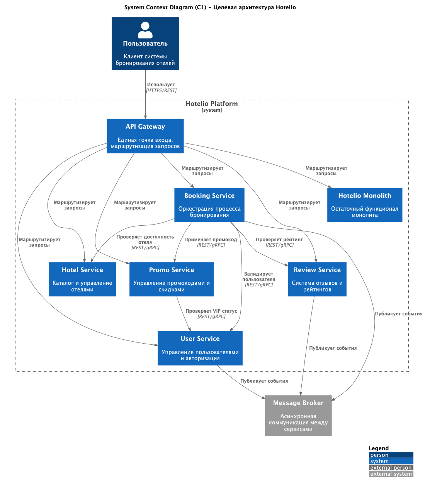
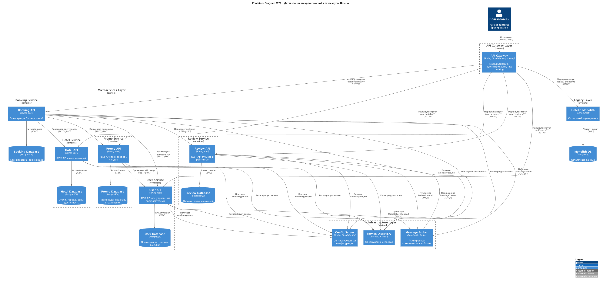

#  Миграция монолита Hotelio на микросервисную архитектуру

**Автор:** Ярослав Л

**Дата:** 2026-02-12

## **Функциональные требования**

| **№** | **Действующие лица или системы** | **Use Case**                    | **Описание**                                                                                                                                                            |
|:-----:|:---------------------------------|:--------------------------------|:------------------------------------------------------------------------------------------------------------------------------------------------------------------------|
|   1   | Пользователь                     | Создание бронирования           | Пользователь создает бронирование отеля с применением промокода. Система валидирует пользователя, проверяет доступность отеля, применяет скидку и создает бронирование. |
|   2   | Пользователь                     | Просмотр каталога отелей        | Пользователь просматривает список отелей по городу, фильтрует по рейтингу и цене.                                                                                       |
|   3   | Пользователь                     | Управление профилем             | Пользователь просматривает свой статус, историю бронирований, VIP-статус.                                                                                               |
|   4   | Пользователь                     | Работа с промокодами            | Пользователь применяет промокод при бронировании. Система проверяет валидность и применимость промокода.                                                                |
|   5   | Пользователь                     | Управление отзывами             | Пользователь оставляет отзывы об отелях, просматривает рейтинги и комментарии других пользователей.                                                                     |
|   6   | Система                          | Независимое масштабирование     | Каждый микросервис может масштабироваться независимо в зависимости от нагрузки.                                                                                         |
|   7   | Команда разработки               | Независимая разработка и деплой | Разные команды могут работать над разными сервисами без конфликтов и блокировок.                                                                                        |

## **Нефункциональные требования**

| **№** | **Требование**                                                                             |
|:-----:|:-------------------------------------------------------------------------------------------|
|   1   | **Масштабируемость**: Независимое масштабирование критичных сервисов при пиковых нагрузках |
|   2   | **Отказоустойчивость**: Отказ одного сервиса не должен ломать всю систему                  |
|   3   | **Независимость разработки**: Разные команды могут работать параллельно без блокировок     |
|   4   | **Обратная совместимость**: Поэтапная миграция без downtime                                |
|   5   | **Наблюдаемость**: Логирование и метрики для отладки                                       |

--- 

# **Решение**

## Целевая архитектура

Применяем паттерн **Strangler Fig** для постепенной миграции монолита на микросервисную архитектуру:

**C1 (System Context):**

**C2 (Container Diagram):**

### Микросервисы (в порядке приоритета миграции):

1. **User Service**
    - Управление пользователями, статусами, blacklist, VIP
    - Собственная БД PostgreSQL (app_user таблица)
    - REST API для валидации пользователей
    - Минимальные зависимости - первый кандидат на миграцию

2. **Hotel Service**
    - Каталог отелей, поиск по городам, топ отелей по рейтингу
    - Собственная БД PostgreSQL (hotel таблица)
    - REST API для поиска и получения информации об отелях
    - Независим от других сервисов - легко выносится

3. **Promo Service**
    - Управление промокодами, валидация, применение скидок
    - Собственная БД PostgreSQL (promo_code таблица)
    - REST API для валидации промокодов
    - Зависит только от User Service (проверка VIP)

4. **Review Service**
    - Отзывы и рейтинги отелей
    - Собственная БД PostgreSQL (review таблица)
    - REST API для создания и получения отзывов
    - Публикует события в Message Broker при создании отзыва

5. **Booking Service** (последний этап)
    - Оркестрация процесса бронирования
    - Собственная БД PostgreSQL (booking таблица)
    - Агрегирует вызовы к User, Hotel, Promo, Review сервисам
    - Публикует события о создании бронирования

### Инфраструктурные компоненты:

- **API Gateway** (Kong)
    - Единая точка входа
    - Аутентификация и авторизация
    - Rate limiting, request routing
    - Маршрутизация на микросервисы и остаточный монолит

- **Service Discovery**
    - Автоматическое обнаружение сервисов
    - Health checks
    - Load balancing

- **Config Server**
    - Централизованное управление конфигурацией
    - Переключение feature flags без передеплоя

- **Message Broker** (RabbitMQ / Kafka)
    - Асинхронная коммуникация между сервисами
    - Event-driven архитектура для слабой связанности
    - События: BookingCreated, ReviewCreated, UserStatusChanged

- **Observability Stack**
    - Logging: ELK Stack (Elasticsearch, Logstash, Kibana)
    - Tracing: Jaeger / Zipkin
    - Metrics: Prometheus + Grafana

## Стратегия миграции (Strangler Fig Pattern):

**Фаза 1: Подготовка инфраструктуры**

- Настройка API Gateway, Service Discovery, Message Broker

**Фаза 2: User Service**

- Выделение из монолита с отдельной БД
- Минимум зависимостей - легко мигрировать первым

**Фаза 3: Hotel Service**

- Каталог отелей с отдельной БД
- Независим от других сервисов

**Фаза 4: Promo Service**

- Промокоды и скидки
- Интеграция с User Service для VIP

**Фаза 5: Review Service**

- Отзывы и рейтинги
- События через Message Broker

**Фаза 6: Booking Service**

- Оркестрация бронирования
- Вызовы всех остальных сервисов
- Saga pattern для транзакций

**Фаза 7: Деактивация монолита**

### Технологический стек:

- **Spring Boot** - консистентный стек с монолитом
- **Python/FastAPI** - асинхронные не нагруженные сервисы
- **Nodejs** - GraphQL
- **PostgreSQL** - отдельная БД для каждого сервиса (Database per Service)
- **REST API** - простота реализации, HTTP/JSON
- **RabbitMQ/Kafka** - асинхронная коммуникация между сервисами
- **API Gateway** - единая точка входа, поддержка Strangler Fig
- **Service Discovery** и балансировка нагрузки

### Управление данными:

- Каждый сервис имеет свою БД для изоляции
- Saga Pattern для распределенных транзакций (бронирование)
- Eventual Consistency для межсервисной коммуникации
- Постепенная миграция данных из монолитной БД

---

## **Альтернативы**

### Альтернатива 1: Big Bang миграция

Полное переписывание всех сервисов одновременно.

- Высокий риск
- Длительный период без новых фичей
- Быстрое достижение целевой архитектуры

**Отклонена:** Слишком рискованно. Strangler Fig обеспечивает безопасную миграцию с откатом.

### Альтернатива 2: Модульный монолит

Рефакторинг монолита с четкими границами, но без разделения на сервисы.

- Проще, чем микросервисы
- Нет проблем с distributed transactions
- Не решает проблему независимого масштабирования
- Не решает проблему независимого деплоя

**Отклонена:** Не решает ключевые проблемы масштабируемости.

--- 

## **Недостатки, ограничения, риски**

### Основные недостатки:

1. **Сложность системы** - distributed система сложнее монолита в debugging и поддержке
2. **Network latency** - межсервисные вызовы добавляют задержки
3. **Eventual consistency** - отказ от ACID транзакций, сложность Saga pattern
4. **Операционная сложность** - больше сервисов для мониторинга и деплоя
5. **Стоимость инфраструктуры** - увеличение на ~40-60%

### Ключевые риски:

| **Риск**                              | **Митигация**                         |
|---------------------------------------|---------------------------------------|
| Performance деградация                | Caching (Redis), оптимизация вызовов  |
| Ошибки в Saga pattern                 | Тестирование, Circuit Breaker         |
| Проблемы с миграцией данных           | Dual writes, постепенное переключение |
| API Gateway - single point of failure | HA режим, минимум 2 инстанса          |
| Сложность debugging                   | Distributed tracing, логирование      |

### Рекомендации:

1. **Начать с PoC** - выделить User Service для проверки подхода
2. **Обучение команды** - distributed systems patterns
3. **Мониторинг** - настроить до миграции
4. **Fallback** - возможность отката на каждом этапе
5. **Тестирование** - integration тесты, performance тесты

