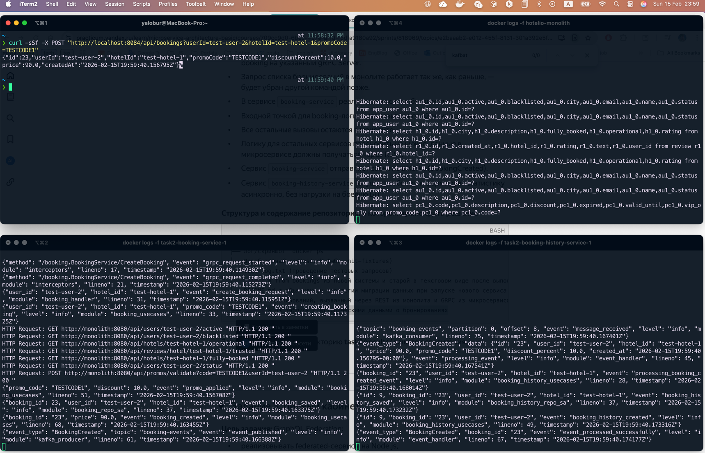
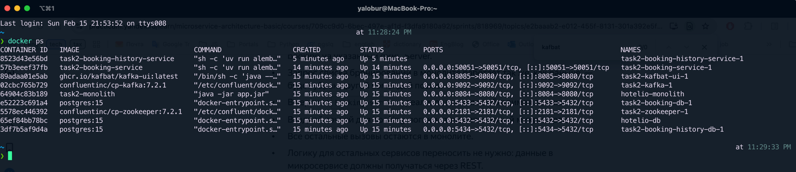

# Результаты второго задания

## Скрин с общим видом работы системы

1. curl запрос в монолит (лево верх)

```shell
curl -sSf -X POST "http://localhost:8084/api/bookings?userId=test-user-2&hotelId=test-hotel-1&promoCode=TESTCODE1"
```

2. логи монолита (право верх)
3. логи grpc сервиса на который проксируется запрос из монолита (лево низ)
4. логи history сервиса в который через кафку grpc сервис отправил событие



## Лог/скриншот `docker ps`



## test-log.txt (проведение тестовых запросов)

```text
~/projects/courses/yandex/mswa/msa-sprint2/test on dev ⇡1 +3 !2 ?4                                                                                                                at 11:42:08 PM
❯ docker run --rm \
  -e DB_HOST=host.docker.internal \
  -e DB_PORT=5432 \
  -e DB_NAME=hotelio \
  -e DB_USER=hotelio \
  -e DB_PASSWORD=hotelio \
  -e API_URL=http://host.docker.internal:8084 \
  hotelio-tester
🏁 Регрессионный тест до миграции Hotelio
🧪 Проверка подключения к БД...
🧪 Загрузка фикстур...
DELETE 4
DELETE 3
DELETE 12
DELETE 3
DELETE 0
INSERT 0 4
INSERT 0 3
INSERT 0 12
INSERT 0 3
INSERT 0 2
🧪 Выполнение HTTP-тестов...

Тесты пользователей...
✅ Получение test-user-1 по ID работает
✅ Статус test-user-1: ACTIVE
✅ test-user-1 в блэклисте
✅ test-user-1 активен
✅ test-user-1 не авторизован (в блэклисте)
✅ test-user-3 — VIP-пользователь
✅ test-user-2 авторизован

Тесты отелей...
✅ test-hotel-1 получен по ID
✅ test-hotel-1 работает
✅ test-hotel-3 не работает
✅ test-hotel-2 полностью забронирован
✅ Поиск отелей в Сеуле работает
✅ Топ-отели в Сеуле загружены

Тесты ревью...
✅ Отзывы test-hotel-1 найдены
✅ test-hotel-1 признан надёжным
✅ test-hotel-3 НЕ признан надёжным (ожидаемо)

Тесты промокодов...
✅ Промокод TESTCODE1 найден
✅ VIP-промо доступен VIP
✅ VIP-промо недоступен обычному
✅ Обычный промо доступен
✅ Истекший промо недоступен
✅ POST /validate промо прошёл

Тесты бронирования...
✅ Бронирование прошло (без промо)
✅ Бронирование с промо прошло
✅ Бронирования test-user-2 найдены
✅ Отклонено: неактивный пользователь
✅ Отклонено: недоверенный отель
✅ Отклонено: отель полностью забронирован
✅ Все HTTP-тесты пройдены!
```

## select * from bookings из новой системы и старой в текстовом виде после выполнения тестов

### Из монолита

```text
[2026-02-15 23:47:12] hotelio.public> select * from booking
[2026-02-15 23:47:12] 2 rows retrieved starting from 1 in 449 ms (execution: 8 ms, fetching: 441 ms)
```

| discount\_percent | price | created\_at                       | id | hotel\_id    | promo\_code | user\_id    |
|:------------------|:------|:----------------------------------|:---|:-------------|:------------|:------------|
| 10                | 90    | 2026-02-15 19:43:16.380336 +00:00 | 13 | test-hotel-1 | TESTCODE1   | test-user-2 |
| 0                 | 80    | 2026-02-15 19:43:16.380336 +00:00 | 14 | test-hotel-1 | null        | test-user-3 |

### Из нового booking-service

```text
[2026-02-15 23:50:31] booking.public> select * from bookings
[2026-02-15 23:50:32] 2 rows retrieved starting from 1 in 404 ms (execution: 7 ms, fetching: 397 ms)
```

| id | user\_id    | hotel\_id    | promo\_code | discount\_percent | price | created\_at                       |
|:---|:------------|:-------------|:------------|:------------------|:------|:----------------------------------|
| 21 | test-user-3 | test-hotel-1 | null        | 0                 | 80    | 2026-02-15 19:43:16.637620 +00:00 |
| 22 | test-user-2 | test-hotel-1 | TESTCODE1   | 10                | 90    | 2026-02-15 19:43:16.672848 +00:00 |

## README.md с объяснением стратегии миграции данных при запуске нового сервиса и стратегии To Be

Подробно это расписывал это в adr первого задания вот тут: [adr.md](../../task1/results/adr.md)

## select * из таблицы с историческими данными о бронированиях

```text
[2026-02-15 23:54:41] booking_history.public> select * from booking_history
[2026-02-15 23:54:41] 2 rows retrieved starting from 1 in 366 ms (execution: 7 ms, fetching: 359 ms)
```

| id | booking\_id | user\_id    | hotel\_id    | promo\_code | discount\_percent | price | created\_at                       |
|:---|:------------|:------------|:-------------|:------------|:------------------|:------|:----------------------------------|
| 7  | 21          | test-user-3 | test-hotel-1 | null        | 0                 | 80    | 2026-02-15 19:43:16.637620 +00:00 |
| 8  | 22          | test-user-2 | test-hotel-1 | TESTCODE1   | 10                | 90    | 2026-02-15 19:43:16.672848 +00:00 |

## Доработанный regress.sh (мб. init-fixtures)

Их дорабатывать особо не пришлось (порядок ток поменял), однако походу в сбилженом jar-нике монолита для второго задания
есть бага, запрос на список бронирований не проходит и ошибка падает именно в монолите, не доходя до grpc сервиса

Вот этот падает (если не указывать user id)

```text
# 1. Получение всех бронирований
curl -sSf "${BASE}/api/bookings" | grep -q 'test-user-2' && pass "Все бронирования получены" || fail "Бронирования не получены"
```

Вот этот (та же ручка только с user id) — проходит

```text
# 2. Получение бронирований пользователя
curl -sSf "${BASE}/api/bookings?userId=test-user-2" | grep -q 'test-user-2' && pass "Бронирования test-user-2 найдены" || fail "Нет бронирований test-user-2"
```

Почитал трейс мололита, выглядит как то что в protobuf-генерации для Java сеттеры не принимают null. И если передавать
null (не указывать в запросе юзер ид) в setUserId(...), внутри билдер кидает NPE
Крч сто проц проблема в коде монолита в джарнике

