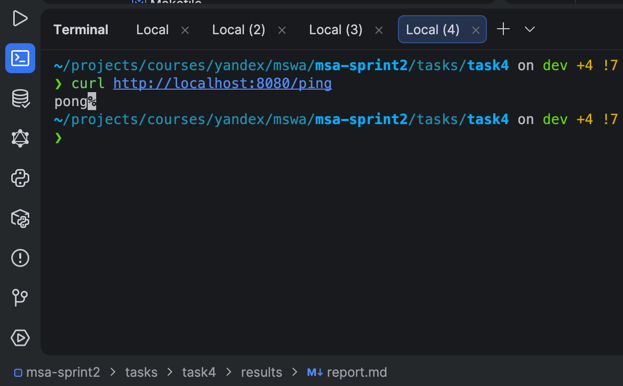
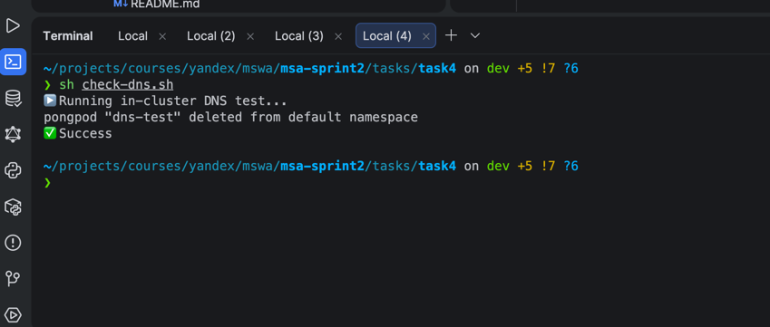
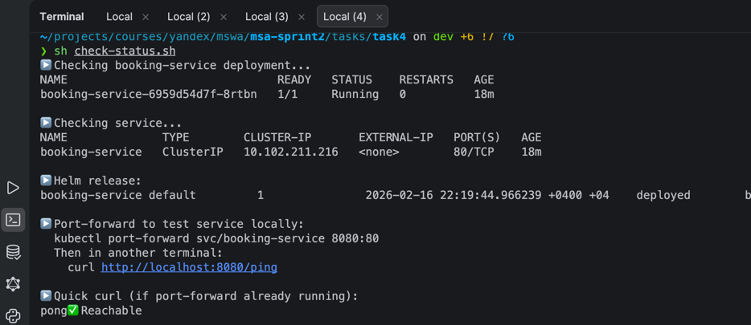
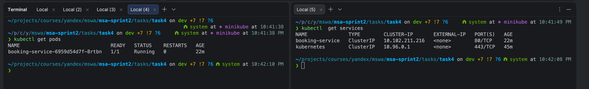
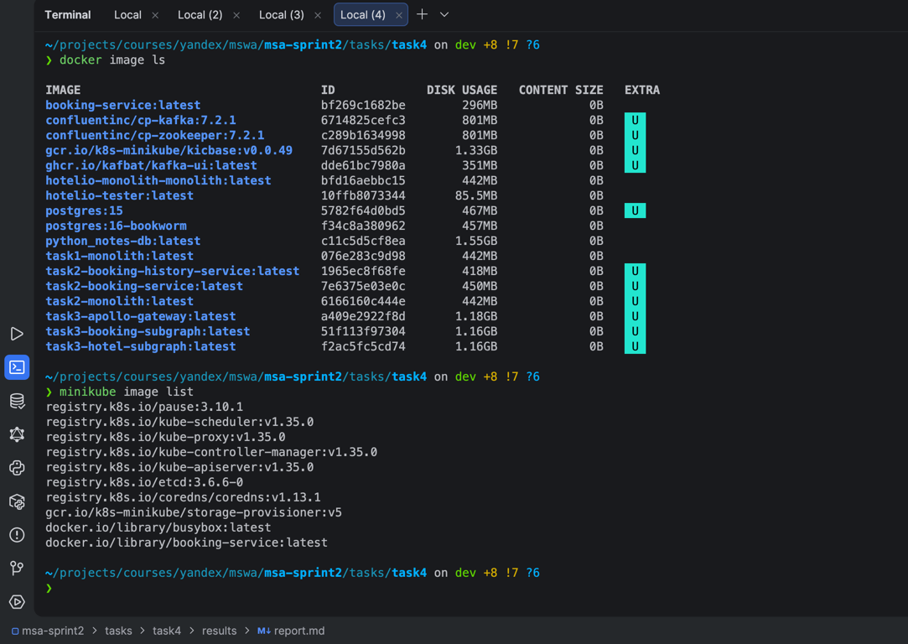

# Отчёт по Заданию 4: Автоматизация развёртывания и тестирования

## Описание изменений

### 1. Реализация Docker-образа сервиса

#### Файл: `booking-service/main.go`

**Добавлены endpoints:**

- `/health` - healthcheck endpoint для liveness probe
- `/ready` - ready endpoint для readiness probe
- `/ping` - существующий endpoint для проверки работоспособности
- `/feature` - endpoint, доступный при `ENABLE_FEATURE_X=true`

**Реализация фича-флага:**

```go
enableFeatureX := os.Getenv("ENABLE_FEATURE_X") == "true"

if enableFeatureX {
    http.HandleFunc("/feature", func(w http.ResponseWriter, r *http.Request) {
        fmt.Fprintf(w, "Feature X is enabled!")
    })
    log.Println("Feature X is ENABLED")
} else {
    log.Println("Feature X is DISABLED")
}
```

#### Файл: `booking-service/Dockerfile`

**Завершены TODO:**

- Установлен пакет `curl` для healthcheck
- Собран Go бинарник `booking-service`
- Установлена команда запуска `CMD ["./booking-service"]`

```dockerfile
FROM golang:1.21-alpine
RUN apk add --no-cache curl
WORKDIR /app
COPY main.go .
RUN go build -o booking-service main.go
CMD ["./booking-service"]
```

### 2. Реализация Helm-чарта

#### Файл: `helm/booking-service/templates/deployment.yaml`

**Добавлены:**

- Environment variables из `values.yaml`
- Liveness probe с HTTP GET запросом на `/health`
- Readiness probe с HTTP GET запросом на `/ready`
- Resources (requests и limits)
- Параметр `imagePullPolicy` из values

```yaml
env:
  { { - range .Values.env } }
  - name: { { .name } }
    value: { { .value | quote } }
    { { - end } }

livenessProbe:
  httpGet:
    path: { { .Values.livenessProbe.path } }
    port: { { .Values.service.targetPort } }
  initialDelaySeconds: { { .Values.livenessProbe.initialDelaySeconds } }
  periodSeconds: { { .Values.livenessProbe.periodSeconds } }

readinessProbe:
  httpGet:
    path: { { .Values.readinessProbe.path } }
    port: { { .Values.service.targetPort } }
  initialDelaySeconds: { { .Values.readinessProbe.initialDelaySeconds } }
  periodSeconds: { { .Values.readinessProbe.periodSeconds } }
```

#### Файл: `helm/booking-service/values.yaml`

**Базовая конфигурация:**

- `replicaCount: 1`
- `imagePullPolicy: Never` (для работы с локальным образом в Minikube)
- `ENABLE_FEATURE_X: "false"`
- Resources: requests (64Mi/100m), limits (128Mi/200m)
- Liveness probe: `/health`, initialDelay 10s, period 10s
- Readiness probe: `/ready`, initialDelay 5s, period 5s

#### Файл: `helm/booking-service/values-staging.yaml`

**Staging конфигурация:**

- `replicaCount: 2` (больше реплик для staging тестов)
- `ENABLE_FEATURE_X: "true"` (фича включена для тестирования)
- Resources: requests (64Mi/100m), limits (128Mi/200m)

#### Файл: `helm/booking-service/values-prod.yaml`

**Production конфигурация:**

- `replicaCount: 3` (максимальная отказоустойчивость)
- `ENABLE_FEATURE_X: "false"` (фича выключена в проде)
- Resources: requests (128Mi/200m), limits (256Mi/500m) - увеличенные ресурсы

### 3. CI/CD-пайплайн

#### Файл: `.gitlab-ci.yml`

**Реализованные стадии:**

1. **build**
    - Переход в директорию `booking-service`
    - Сборка Docker образа: `docker build -t booking-service:latest`
    - Проверка созданного образа

2. **test**
    - Запуск контейнера в detached режиме
    - Проверка endpoints: `/ping`, `/health`, `/ready`
    - Остановка и удаление тестового контейнера

3. **deploy**
    - Загрузка образа в Minikube: `minikube image load`
    - Деплой через Helm: `helm upgrade --install`
    - Проверка статуса rollout
    - Вывод информации о pods и services

4. **tag**
    - Создание git-тега с timestamp: `deploy-YYYYMMDD-HHMMSS`
    - Выполняется только для ветки `main`

### 4. Service Discovery через DNS

**Реализовано:**

- Service типа `ClusterIP` для внутрикластерного доступа
- DNS имя: `booking-service` (доступно внутри кластера)
- Порты: `80 → 8080` (внешний → внутренний)

**Проверка доступности:**

- Внутри кластера: `http://booking-service/ping`
- Снаружи через port-forward: `kubectl port-forward svc/booking-service 8080:80`

## Проверка работоспособности

### Команды для проверки

```bash
# Проверка статуса деплоя
./check-status.sh

# Проверка DNS внутри кластера
./check-dns.sh

# Port-forward для локального доступа
kubectl port-forward svc/booking-service 8080:80

# Тестирование endpoints
curl http://localhost:8080/ping
curl http://localhost:8080/health
curl http://localhost:8080/ready
```

### Ожидаемые результаты

**curl http://localhost:8080/ping:**

```
pong
```

**curl http://localhost:8080/health:**

```
healthy
```

**curl http://localhost:8080/ready:**

```
ready
```

**С включенным feature flag (staging):**

```bash
curl http://localhost:8080/feature
# Output: Feature X is enabled!
```

## Структура проекта

```
task4/
├── booking-service/
│   ├── Dockerfile          # Завершён
│   └── main.go             # Endpoints добавлены
├── helm/
│   └── booking-service/
│       ├── Chart.yaml
│       ├── templates/
│       │   ├── deployment.yaml  # Probes, env, resources
│       │   └── service.yaml
│       ├── values.yaml          # Базовая конфигурация
│       ├── values-staging.yaml  # Staging конфигурация
│       └── values-prod.yaml     # Production конфигурация
├── .gitlab-ci.yml          # Pipeline реализован
├── check-dns.sh
├── check-status.sh
└── results/
    └── report.md
```

## Ключевые решения

1. **imagePullPolicy: Never** - используется для работы с локальными образами в Minikube
2. **Два варианта values** - staging с включенной фичей и 2 репликами, prod с выключенной фичей и 3 репликами
3. **Разные resource limits** - staging (128Mi/200m), prod (256Mi/500m)
4. **Probe delays** - readiness быстрее (5s), liveness более консервативный (10s)
5. **Service type ClusterIP** - для внутрикластерного DNS-based service discovery

## Следующие шаги для проверки

1. Запустить Minikube: `minikube start`
2. Собрать образ: `docker build -t booking-service:latest ./booking-service`
3. Загрузить в Minikube: `minikube image load booking-service:latest`
4. Задеплоить: `helm upgrade --install booking-service ./helm/booking-service`
5. Проверить: `./check-status.sh` и `./check-dns.sh`
6. Протестировать endpoints через port-forward

## Proof of work

### Скриншот успешного curl на /ping



### Скриншот ./check-dns.sh



### Скриншот ./check-status



### kubectl get pods + get services



### Лог успешной сборки

```text
 make ci         
gitlab-ci-local
parsing and downloads finished in 123 ms.
json schema validated in 128 ms
build  starting shell (build)
build  $ cd booking-service
build  $ docker build -t ${IMAGE_NAME}:${IMAGE_TAG} .
build  > #0 building with "desktop-linux" instance using docker driver
build  > 
build  > #1 [internal] load build definition from Dockerfile
build  > #1 transferring dockerfile: 558B done
build  > #1 DONE 0.0s
build  > 
build  > #2 [internal] load metadata for docker.io/library/golang:1.21-alpine
build  > #2 ...
build  > 
build  > #3 [auth] library/golang:pull token for registry-1.docker.io
build  > #3 DONE 0.0s
build  > 
build  > #2 [internal] load metadata for docker.io/library/golang:1.21-alpine
build  > #2 DONE 3.4s
build  > 
build  > #4 [internal] load .dockerignore
build  > #4 transferring context: 2B done
build  > #4 DONE 0.0s
build  > 
build  > #5 [internal] load build context
build  > #5 transferring context: 999B 0.0s done
build  > #5 DONE 0.0s
build  > 
build  > #6 [1/5] FROM docker.io/library/golang:1.21-alpine@sha256:2414035b086e3c42b99654c8b26e6f5b1b1598080d65fd03c7f499552ff4dc94
build  > #6 resolve docker.io/library/golang:1.21-alpine@sha256:2414035b086e3c42b99654c8b26e6f5b1b1598080d65fd03c7f499552ff4dc94 done
build  > #6 sha256:2414035b086e3c42b99654c8b26e6f5b1b1598080d65fd03c7f499552ff4dc94 10.30kB / 10.30kB done
build  > #6 sha256:5bc6d0431a4fdc57fb24d437c177c5e02fde1d0585eeb4c5d483c1b65aebfb00 1.92kB / 1.92kB done
build  > #6 sha256:2bbe4e7e4d4e0f6f1b6c7192f01b9c7099e921b9fe8eae0c5c939a1d257f7e81 2.10kB / 2.10kB done
build  > #6 sha256:690e87867337b8441990047e169b892933e9006bdbcbed52ab7a356945477a4d 0B / 4.09MB 0.1s
build  > #6 sha256:171883aaf475f5dea5723bb43248d9cf3f3c3a7cf5927947a8bed4836bbccb62 0B / 293.51kB 0.1s
build  > #6 sha256:2a6022646f09ee78a83ef4abd0f5af04071b6563cf16a18e00fb2dcfe63ca0a3 0B / 64.11MB 0.1s
build  > #6 sha256:690e87867337b8441990047e169b892933e9006bdbcbed52ab7a356945477a4d 1.05MB / 4.09MB 0.6s
build  > #6 sha256:690e87867337b8441990047e169b892933e9006bdbcbed52ab7a356945477a4d 2.10MB / 4.09MB 0.8s
build  > #6 sha256:690e87867337b8441990047e169b892933e9006bdbcbed52ab7a356945477a4d 3.15MB / 4.09MB 0.9s
build  > #6 sha256:171883aaf475f5dea5723bb43248d9cf3f3c3a7cf5927947a8bed4836bbccb62 293.51kB / 293.51kB 0.8s done
build  > #6 sha256:e495e1face5cc12777f452389e1da15202c37ec00ba024f12f841b5c90a47057 0B / 127B 0.9s
build  > #6 sha256:690e87867337b8441990047e169b892933e9006bdbcbed52ab7a356945477a4d 4.09MB / 4.09MB 0.9s done
build  > #6 extracting sha256:690e87867337b8441990047e169b892933e9006bdbcbed52ab7a356945477a4d 0.1s done
build  > #6 sha256:4f4fb700ef54461cfa02571ae0db9a0dc1e0cdb5577484a6d75e68dc38e8acc1 0B / 32B 1.0s
build  > #6 extracting sha256:171883aaf475f5dea5723bb43248d9cf3f3c3a7cf5927947a8bed4836bbccb62
build  > #6 extracting sha256:171883aaf475f5dea5723bb43248d9cf3f3c3a7cf5927947a8bed4836bbccb62 0.0s done
build  > #6 sha256:2a6022646f09ee78a83ef4abd0f5af04071b6563cf16a18e00fb2dcfe63ca0a3 4.19MB / 64.11MB 1.5s
build  > #6 sha256:e495e1face5cc12777f452389e1da15202c37ec00ba024f12f841b5c90a47057 127B / 127B 1.3s done
build  > #6 sha256:4f4fb700ef54461cfa02571ae0db9a0dc1e0cdb5577484a6d75e68dc38e8acc1 32B / 32B 1.4s done
build  > #6 sha256:2a6022646f09ee78a83ef4abd0f5af04071b6563cf16a18e00fb2dcfe63ca0a3 8.39MB / 64.11MB 2.4s
build  > #6 sha256:2a6022646f09ee78a83ef4abd0f5af04071b6563cf16a18e00fb2dcfe63ca0a3 12.58MB / 64.11MB 3.2s
build  > #6 sha256:2a6022646f09ee78a83ef4abd0f5af04071b6563cf16a18e00fb2dcfe63ca0a3 16.78MB / 64.11MB 4.0s
build  > #6 sha256:2a6022646f09ee78a83ef4abd0f5af04071b6563cf16a18e00fb2dcfe63ca0a3 20.97MB / 64.11MB 4.7s
build  > #6 sha256:2a6022646f09ee78a83ef4abd0f5af04071b6563cf16a18e00fb2dcfe63ca0a3 25.17MB / 64.11MB 5.6s
build  > #6 sha256:2a6022646f09ee78a83ef4abd0f5af04071b6563cf16a18e00fb2dcfe63ca0a3 30.41MB / 64.11MB 6.4s
build  > #6 sha256:2a6022646f09ee78a83ef4abd0f5af04071b6563cf16a18e00fb2dcfe63ca0a3 34.60MB / 64.11MB 7.3s
build  > #6 sha256:2a6022646f09ee78a83ef4abd0f5af04071b6563cf16a18e00fb2dcfe63ca0a3 39.85MB / 64.11MB 8.2s
build  > #6 sha256:2a6022646f09ee78a83ef4abd0f5af04071b6563cf16a18e00fb2dcfe63ca0a3 44.04MB / 64.11MB 8.9s
build  > #6 sha256:2a6022646f09ee78a83ef4abd0f5af04071b6563cf16a18e00fb2dcfe63ca0a3 48.23MB / 64.11MB 9.8s
build  > #6 sha256:2a6022646f09ee78a83ef4abd0f5af04071b6563cf16a18e00fb2dcfe63ca0a3 52.43MB / 64.11MB 10.7s
build  > #6 sha256:2a6022646f09ee78a83ef4abd0f5af04071b6563cf16a18e00fb2dcfe63ca0a3 56.62MB / 64.11MB 11.4s
build  > #6 sha256:2a6022646f09ee78a83ef4abd0f5af04071b6563cf16a18e00fb2dcfe63ca0a3 60.82MB / 64.11MB 12.1s
build  > #6 sha256:2a6022646f09ee78a83ef4abd0f5af04071b6563cf16a18e00fb2dcfe63ca0a3 64.11MB / 64.11MB 12.6s done
build  > #6 extracting sha256:2a6022646f09ee78a83ef4abd0f5af04071b6563cf16a18e00fb2dcfe63ca0a3 0.1s
build  > #6 extracting sha256:2a6022646f09ee78a83ef4abd0f5af04071b6563cf16a18e00fb2dcfe63ca0a3 3.0s done
build  > #6 extracting sha256:e495e1face5cc12777f452389e1da15202c37ec00ba024f12f841b5c90a47057
build  > #6 extracting sha256:e495e1face5cc12777f452389e1da15202c37ec00ba024f12f841b5c90a47057 done
build  > #6 extracting sha256:4f4fb700ef54461cfa02571ae0db9a0dc1e0cdb5577484a6d75e68dc38e8acc1 done
build  > #6 DONE 15.9s
build  > 
build  > #7 [2/5] RUN apk add --no-cache curl
build  > #7 0.116 fetch https://dl-cdn.alpinelinux.org/alpine/v3.20/main/aarch64/APKINDEX.tar.gz
build  > #7 0.476 fetch https://dl-cdn.alpinelinux.org/alpine/v3.20/community/aarch64/APKINDEX.tar.gz
build  > #7 0.790 (1/9) Installing brotli-libs (1.1.0-r2)
build  > #7 0.872 (2/9) Installing c-ares (1.33.1-r0)
build  > #7 0.925 (3/9) Installing libunistring (1.2-r0)
build  > #7 1.032 (4/9) Installing libidn2 (2.3.7-r0)
build  > #7 1.085 (5/9) Installing nghttp2-libs (1.62.1-r0)
build  > #7 1.134 (6/9) Installing libpsl (0.21.5-r1)
build  > #7 1.183 (7/9) Installing zstd-libs (1.5.6-r0)
build  > #7 1.265 (8/9) Installing libcurl (8.14.1-r2)
build  > #7 1.343 (9/9) Installing curl (8.14.1-r2)
build  > #7 1.410 Executing busybox-1.36.1-r29.trigger
build  > #7 1.415 OK: 15 MiB in 24 packages
build  > #7 DONE 1.7s
build  > 
build  > #8 [3/5] WORKDIR /app
build  > #8 DONE 0.0s
build  > 
build  > #9 [4/5] COPY main.go .
build  > #9 DONE 0.0s
build  > 
build  > #10 [5/5] RUN go build -o booking-service main.go
build  > #10 DONE 3.3s
build  > 
build  > #11 exporting to image
build  > #11 exporting layers 0.1s done
build  > #11 writing image sha256:bf269c1682be55c4b6fa9a9d127dc5e38d30ef98e9afe4afda4939dfc727908b done
build  > #11 naming to docker.io/library/booking-service:latest
build  > #11 naming to docker.io/library/booking-service:latest done
build  > #11 DONE 0.1s
build  $ docker images | grep ${IMAGE_NAME}
build  > WARNING: This output is designed for human readability. For machine-readable output, please use --format.
build  > booking-service:latest                 bf269c1682be        296MB             0B        
build  > task2-booking-service:latest           7e6375e03e0c        450MB             0B   U    
build  finished in 25 s
test   starting shell (test)
test   $ docker run -d --name test-container -p 8080:8080 ${IMAGE_NAME}:${IMAGE_TAG}
test   > adc9cfc85526b8d5b55a65ea5fcb1c9dc1572670931103543a195dc6bd2e2d74
test   $ sleep 5
test   $ curl -f http://localhost:8080/ping || exit 1
test   >   % Total    % Received % Xferd  Average Speed   Time    Time     Time  Current
test   >                                  Dload  Upload   Total   Spent    Left  Speed
100     4  100     4    0     0   1125      0 --:--:-- --:--:-- --:--:--  1333
test   > pong<gclShellPromptPlaceholder> curl -f http://localhost:8080/health || exit 1
test   >   % Total    % Received % Xferd  Average Speed   Time    Time     Time  Current
test   >                                  Dload  Upload   Total   Spent    Left  Speed
100     7  100     7    0     0   2593      0 --:--:-- --:--:-- --:--:--  3500
test   > healthy<gclShellPromptPlaceholder> curl -f http://localhost:8080/ready || exit 1
test   >   % Total    % Received % Xferd  Average Speed   Time    Time     Time  Current
test   >                                  Dload  Upload   Total   Spent    Left  Speed
100     5  100     5    0     0   1581      0 --:--:-- --:--:-- --:--:--  1666
test   > ready<gclShellPromptPlaceholder> docker rm -f test-container
test   > test-container
test   finished in 5.43 s
deploy starting shell (deploy)
deploy $ minikube image load ${IMAGE_NAME}:${IMAGE_TAG}
deploy > still running...
deploy $ helm upgrade --install booking-service ./helm/booking-service --values ./helm/booking-service/values.yaml
deploy > Release "booking-service" does not exist. Installing it now.
deploy > NAME: booking-service
deploy > LAST DEPLOYED: Mon Feb 16 22:19:44 2026
deploy > NAMESPACE: default
deploy > STATUS: deployed
deploy > REVISION: 1
deploy > DESCRIPTION: Install complete
deploy > TEST SUITE: None
deploy $ kubectl rollout status deployment/booking-service
deploy > Waiting for deployment "booking-service" rollout to finish: 0 of 1 updated replicas are available...
deploy > deployment "booking-service" successfully rolled out
deploy $ kubectl get pods -l app=booking-service
deploy > NAME                               READY   STATUS    RESTARTS   AGE
deploy > booking-service-6959d54d7f-8rtbn   1/1     Running   0          7s
deploy $ kubectl get svc booking-service
deploy > NAME              TYPE        CLUSTER-IP       EXTERNAL-IP   PORT(S)   AGE
deploy > booking-service   ClusterIP   10.102.211.216   <none>        80/TCP    7s
deploy finished in 26 s
tag    starting shell (tag)
tag    $ TIMESTAMP=$(date +%Y%m%d-%H%M%S)
tag    $ git tag "deploy-${TIMESTAMP}"
tag    $ echo "Created tag deploy-${TIMESTAMP}"
tag    > Created tag deploy-20260216-221952
tag    finished in 54 ms

 PASS  build 
 PASS  test  
 PASS  deploy
 PASS  tag   
pipeline finished in 56 s
```

### docker image ls + minikube image list

